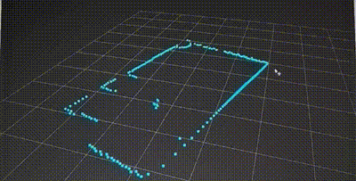

# LDS-006-Lidar-Sensor-Library

Simple ROS-publisher to attach sensor at my drone. Not used in any project.

## How to use

Clone branch into your `catkin_ws/src` folder. Run `catkin build`. Source `catkin_ws/devel/setup.bash`. Then:

```
pip install -r requirements.txt
rosrun ros_noetic_lidar_sensor lds_generator.py
```

Optional arguments before starting `port` and `frame_id`:

```
rosparam set port /dev/serial0
rosparam set frame_id lidar_frame
```

## Results

`rviz` subscribed to lidar topic. Me walking in the room. -> while thinking about this, everything appears to be mirrored. 



## Reminder to me

Always set `ROS_MASTER_URI` and `ROS_IP`:

@RPI
```
export ROS_IP=192.168.1.2
```

@Ubuntu
```
export ROS_IP=172.24.160.1
export ROS_MASTER_URI=http://192.168.1.2:11311/
```

@Windows (rviz on Windows)
```
set ROS_IP=192.168.1.4
set ROS_MASTER_URI=http://192.168.1.2:11311/
```